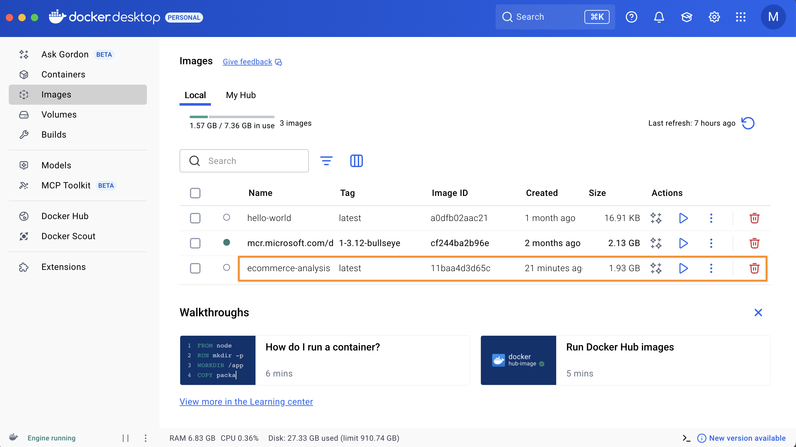
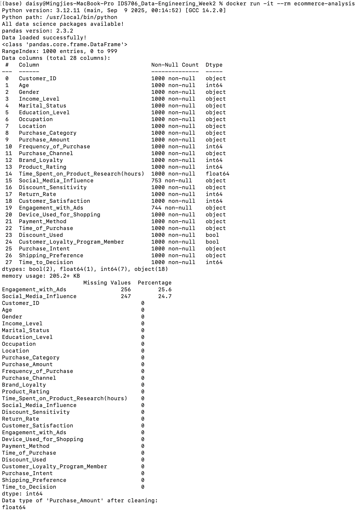
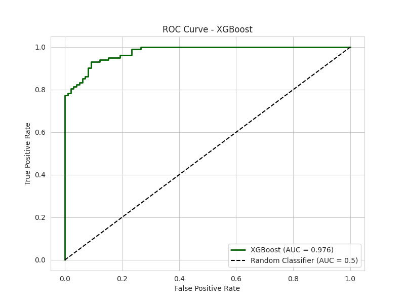
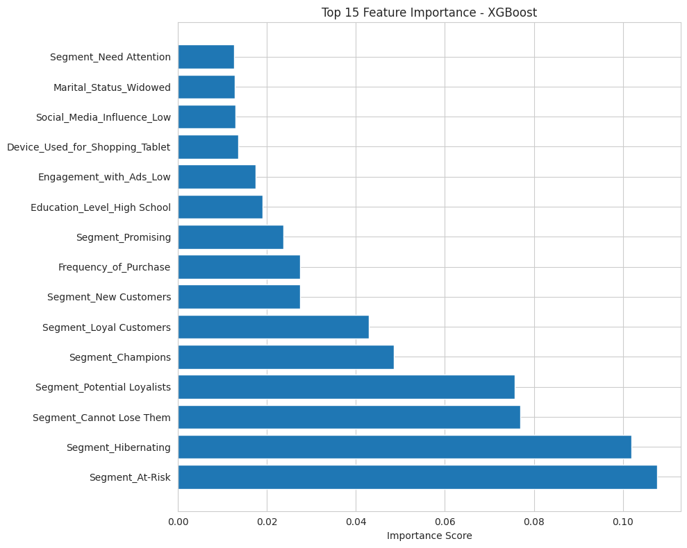
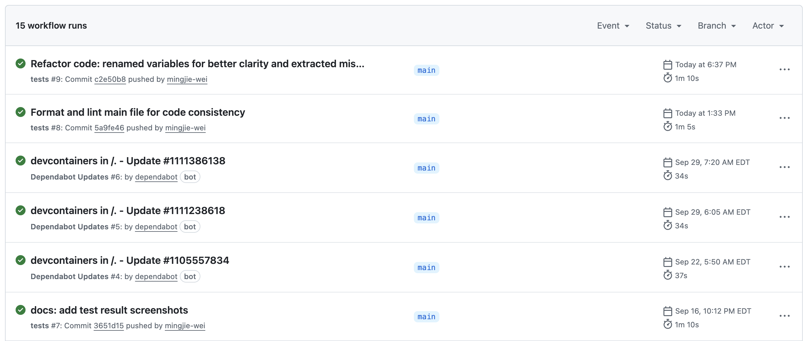
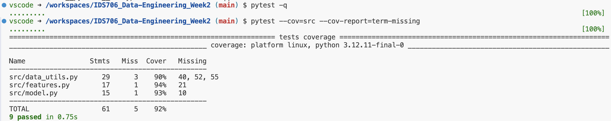
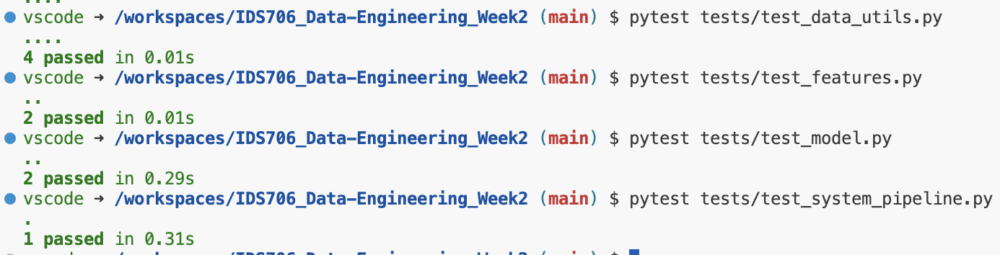
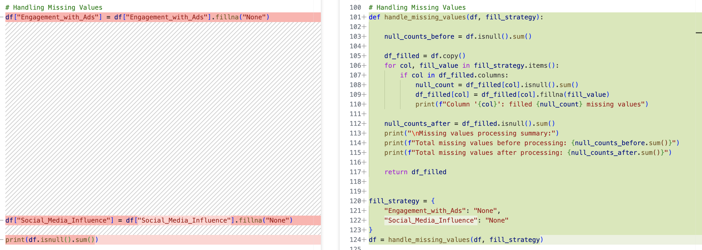
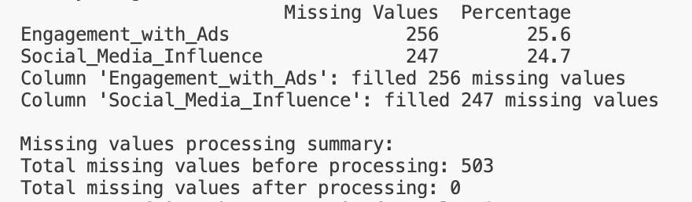
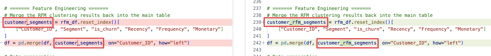

# Ecommerce Consumer Behavior Analysis Project
[](https://github.com/mingjie-wei/IDS706_Data-Engineering_Week2/actions/workflows/tests.yml)
[](.devcontainer/devcontainer.json)
[](Dockerfile)


This project delivers an end-to-end analytics workflow on e-commerce consumer behavior, covering data ingestion, cleaning, exploratory analysis, RFM-based customer segmentation, feature engineering, and binary classification using Logistic Regression and XGBoost. Visualizations (distribution plots, ROC curves, feature importance) are used to explain results and actionable insights.

**Project Goal:** Predict the likelihood of customer churn, where churn is defined as having no purchase activity within the past 180 days.

**Data Source:** [Kaggle – Ecommerce Consumer Behavior Analysis Dataset](https://www.kaggle.com/datasets/salahuddinahmedshuvo/ecommerce-consumer-behavior-analysis-data/data)


# Project Overview
### Data Pipeline
```
Raw Data (1,000 records × 28 features)
    ↓
Data Cleaning (Handle 503 missing values)
    ↓
Feature Engineering (79 features after encoding)
    ↓
RFM Segmentation (10 customer segments)
    ↓
Model Training (80/20 split)
    ↓
Predictions (89-90% accuracy)
```

### Key Findings
- High Churn Risk Indicators (Positive Coefficients)

    - Segment_Hibernating (+3.71): Dormant customers with highest churn likelihood
    - Segment_At-Risk (+3.55): Previously active customers showing decline
    - Segment_Cannot Lose Them (+2.97): High-value customers needing immediate attention

- Retention Indicators (Negative Coefficients)

    - Segment_Potential Loyalists (-3.69): Customers showing loyalty potential
    - Segment_Champions (-3.18): Best customers with lowest churn risk
    - Segment_New Customers (-2.57): Recently acquired customers
    - Segment_Promising (-2.46): Customers with growth potential
    - Segment_Loyal Customers (-1.32): Regular, satisfied customers

- Interesting Insights

    - Software & Apps Category (-0.59): Products with better retention

### Business Recommendations
- Immediate Actions (0-30 days)

    - At-Risk Customers: Deploy personalized email campaign with 25% discount
    - Champions: Launch VIP loyalty tier with exclusive benefits

- Strategic Initiatives (30-90 days)

    - Hibernating Segment: Test aggressive discounting (40-50%); implement win-back campaign with survey
    - Potential Loyalists: Personalized product recommendations; automated onboarding sequence


# Project Structure
```bash
.
├── README.md
├── requirements.txt
├── Makefile
├── Dockerfile
├── .dockerignore
├── .gitignore
├── pytest.ini                         # pytest config (e.g., pythonpath=., addopts)
├── .flake8                            # Flake8 rules (ignores, max line length, excludes)
├── pyproject.toml                     # Tooling config (e.g., Black line length/target py)
├── .github/
│   └── workflows/
│       └── tests.yml                  # CI: run tests on push/PR (with coverage)
│   └── dependabot.yml
├── .devcontainer/
│   └── devcontainer.json
├── src/                               # Application/reusable code
│   ├── data_utils.py
│   ├── features.py
│   └── model.py
├── tests/                             # Test code
│   ├── conftest.py
│   ├── test_data_utils.py
│   ├── test_features.py
│   ├── test_model.py
│   └── test_system_pipeline.py
├── data/
│   └── Ecommerce_Consumer_Behavior_Analysis_Data.csv  # Real dataset (used in system tests)
├── docs/
│   └── images/
├── scripts/                           # scripts
│   └── ecommerce_behavior_analysis_show.py
└── notebooks/                         # Jupyter notebooks
    └── ecommerce_behavior_analysis.ipynb
```


# Setup Instructions
## Dev Container Setup

### Prerequisites
- Docker Desktop installed and running
- VS Code with Dev Containers extension

### Quick Start

#### 1. Clone the repository
```bash
git clone https://github.com/mingjie-wei/IDS706_Data-Engineering_Week2.git
cd IDS706_Data-Engineering_Week2
```

#### 2. Open in VS Code
```bash
code .
```

#### 3. Set up Dev Container
- Press Ctrl+Shift+P (Windows) or Shift+Command+P (Mac)

- Select "Dev Containers: Add Development Container Configuration Files"

- Choose "Add configuration to workspace" (recommended for team sharing)

- Select "Python" template → Choose Python version (e.g., 3.12)

- Skip additional features (optional)

- Optional: Add Dependabot configuration for automated dependency updates

#### 4. Reopen in Container
- Click "Reopen in Container" when prompted

- First-time build may take 5-15 minutes (depends on network speed)

### Verification
After successful build, confirm:

- VS Code status bar shows "Dev Container: Python 3"

- Terminal operates within the container environment

- Python packages are accessible

### Lessons Learned

#### 1. Successful Implementation
- Environment consistency: Dev Containers eliminate "works on my machine" issues

- Reproducibility: Containerization ensures identical environments across all setups

- Automation: Dependabot reduces maintenance overhead for dependency updates

#### 2. Challenges Overcome
- Initial setup: Required Docker and VS Code extension installation

- First build time: Significant initial download but fast subsequent builds

- Configuration choices: Selected workspace-level configuration for better collaboration

## Docker Setup

### 1. Docker Build Process
The Dockerfile defines the steps to build the project's Docker image. It installs dependencies from requirements.txt and copies the entire project into the container.
```
docker build -t ecommerce-analysis .
```
- **-t ecommerce-analysis**: Tags the image with a name for easy reference.
- **.**: Specifies the current directory as the build context.
- To force a fresh build and ignore cached layers, use the --no-cache flag: `docker build -t ecommerce-analysis . --no-cache`



### 2. Running the Container
```
docker run -it --rm ecommerce-analysis
```
- **-it**: Runs the container interactively, linking  terminal to the container's output.
- **--rm**: Automatically removes the container upon exit, keeping system clean.



### 3. Key Troubleshooting Scenarios

#### File Not Found Errors
This is an issue I encountered where the container fails to locate data due to a mismatch between the local file system and the container's.
- **Problem**: A file exists locally but the container reports it's missing (e.g., `Error: Unable to locate data file at /app/data/...`).
- **Reason**: The file was not copied into the image during the build process, most likely due to a rule in the .dockerignore file.
- **Solution**:
    - Inspect the `.dockerignore` file and ensure it does not contain a rule that accidentally excludes the `data` folder or its contents.
    - If the problem persists, use an explicit `COPY` command in the `Dockerfile` to guarantee the files are included.

#### Dynamic Path Handling for Development
To ensure Python scripts work correctly in both the local development container and the final Docker image, avoid hard-coding paths.
- **Problem**: A relative path like `../data/file.csv` works locally but fails inside a container where the working directory might be different.
- **Solution**: Use dynamic path logic within Python code to check for different possible locations (e.g., local and container paths) or use an environment variable to determine the correct path.
```
import os
# Example for handling data file path
data_path = os.getenv('IS_DOCKER_CONTAINER') == 'true' and '/app/data/file.csv' or 'data/file.csv'
# Ensure this variable is set in the Dockerfile: ENV IS_DOCKER_CONTAINER=true
```
This is also applicable to saving plots or other generated output.

#### Debugging a Running Container
To directly inspect the container's file system or environment, we can start an interactive shell.
- Access the Container's Shell:
```
docker run -it --rm ecommerce-analysis sh
```
- Inside the shell, use commands to verify files:
```
$ls -l /app$ ls -l /app/data
```
This will confirm if the files were successfully copied into the image, allowing us to quickly diagnose build-related issues.


## Data Access (Two Options)
I used two ways to obtain the dataset and kept both for reproducibility:

### Option A: Local CSV (default & used in system tests)
- If the CSV is already included in the repo: the code reads `data/Ecommerce_Consumer_Behavior_Analysis_Data.csv` by default, no setup needed.
- If you prefer to prepare it yourself: download from [Kaggle – Ecommerce Consumer Behavior Analysis Dataset](https://www.kaggle.com/datasets/salahuddinahmedshuvo/ecommerce-consumer-behavior-analysis-data/data) and save as `data/Ecommerce_Consumer_Behavior_Analysis_Data.csv`


### Option B: API Download (Kaggle)

#### 1. Obtain Kaggle API Token
- Login to your Kaggle account

- Click on your profile picture → "Account"

- Scroll to "API" section

- Click "Create New API Token"

- This will download a kaggle.json file

#### 2. Secure Configuration
```bash
# Create directory for Kaggle configuration
mkdir kaggle

# Place kaggle.json in the directory (never commit this!)
# Then set up secure permissions within the development container
mkdir -p ~/.kaggle
cp kaggle/kaggle.json ~/.kaggle/
chmod 600 ~/.kaggle/kaggle.json  # Critical security step
```

#### 3. Install Kaggle CLI
```bash
# Install within development environment
pip install kaggle
```

#### 4. Download Dataset
```bash
# Download the ecommerce dataset
kaggle datasets download -d salahuddinahmedshuvo/ecommerce-consumer-behavior-analysis-data -p ./data

# Extract the compressed files
unzip ./data/ecommerce-consumer-behavior-analysis-data.zip -d ./data

# Alternative: Use Python for extraction
python -m zipfile -e ./data/ecommerce-consumer-behavior-analysis-data.zip ./data
```

#### 5. .gitignore Protection
Ensure your .gitignore contains:

```bash
# Kaggle API protection
kaggle/kaggle.json
*.json

# Data files protection
data/*.zip
data/*.json
data/*/

# System files
.DS_Store
```

#### 6. Verification Commands
```bash
# Verify API configuration
kaggle --version

# Test API connectivity
kaggle datasets list -s "ecommerce" --max-size 3

# Verify file permissions (should show -rw-------)
ls -la ~/.kaggle/
```

## Optional: Jupyter Notebook Environment Setup

### Environment Configuration

#### 1. Create Notebooks Directory
```bash
# Create dedicated directory for Jupyter notebooks
mkdir notebooks

# Navigate to notebooks directory
cd notebooks

# Create main analysis notebook
touch ecommerce_behavior_analysis.ipynb

# Return to project root
cd ..
```

#### 2. Package Installation
```bash
# Install essential data science packages
pip install pandas matplotlib seaborn scikit-learn jupyter ipykernel

# Verify installation
python -c "import pandas as pd; print(f'pandas {pd.__version__} installed successfully')"
```

#### 3. Requirements Management
```bash
# Generate requirements.txt in project root
# pip freeze > requirements.txt
cat > requirements.txt <<'EOF'
pandas
matplotlib
seaborn
plotly
scikit-learn
xgboost
imbalanced-learn
jupyter
ipykernel
kaggle>=1.6
shap>=0.48.0
numba>=0.61.0
numpy<2.3
EOF
```

### Jupyter Notebook Configuration

#### 1. Opening Notebooks
```bash
# Method 1: VS Code File Explorer
# Click on notebooks/ecommerce_behavior_analysis.ipynb

# Method 2: Terminal command
code notebooks/ecommerce_behavior_analysis.ipynb
```

#### 2. Kernel Selection
- Open .ipynb file in VS Code

- Click "Select Kernel" in top-right corner

- Choose: Python 3.12.11 (/usr/local/bin/python)

- Avoid system Python (/usr/bin/python3)

#### 3. Verification Cell
```bash
# Environment test cell
import sys
print("Python version:", sys.version)
print("Python path:", sys.executable)

# Test essential packages
try:
    import pandas as pd
    import matplotlib.pyplot as plt
    import seaborn as sns
    from sklearn import datasets
    print("All data science packages available!")
    print(f"pandas version: {pd.__version__}")
except ImportError as e:
    print("Package import failed:", e)
```


# Data Analysis Steps

### 1. Environment & Dependency Check
Verify Python and core DS stack (pandas / matplotlib / seaborn / scikit-learn / xgboost).

### 2. Data Loading
Read from data/Ecommerce_Consumer_Behavior_Analysis_Data.csv; inspect schema and sample.

### 3. Data Cleaning
- Missing values: scan counts and percentages; fill categorical gaps (e.g., Engagement_with_Ads, Social_Media_Influence) with 'None'.

- Type fixes: strip '$' and cast Purchase_Amount to float; parse Time_of_Purchase as datetime.

### 4. Exploratory Analysis
Category distributions (e.g., Purchase_Category), histograms (e.g., Customer_Satisfaction) and other univariate/bivariate checks.

### 5. RFM Customer Segmentation
- Compute Recency, Frequency, Monetary and 5-quantile R/F/M scores.

- Define churn label is_churn = (Recency > 180).

- Map RF combinations to human-readable segments (e.g., Hibernating, At-Risk, Cannot Lose Them, About to Sleep, Need Attention, Loyal Customers, Promising, New Customers, Potential Loyalists, Champions).

- Merge segments back to the main table.

### 6. Feature Engineering
One-hot encode categorical features (with drop_first=True), standardize numerical features, and assemble the training matrix.

### 7. Modeling & Evaluation
- Logistic Regression as a baseline; accuracy and classification report.

- XGBoost with core hyperparameters; report Accuracy and AUC; plot ROC and feature importance.

### 8. Visualization
Distribution plots, ROC curves, and feature-importance bar charts for interpretability.




### 9. Model Conclusions & Important Variables
Based on the current notebook runs (train/test split ≈ 800/200, post-encoding ~79 features, balanced classes ~51%/49%):

#### Logistic Regression：
- Accuracy: ~0.905 on the test set.

- Most impactful variables:
    - Positive (↑ churn odds): Segment_Hibernating (+3.71), Segment_At-Risk (+3.55), Segment_Cannot Lose Them (+2.97).

    - Negative (↓ churn odds): Segment_Potential Loyalists (−3.69), Segment_Champions (−3.18), Segment_New Customers (−2.57), Segment_Promising (−2.46), Segment_Loyal Customers (−1.32), Gender_Bigender (−0.59), Purchase_Category_Software & Apps (−0.59).

- Interpretation: RFM-derived segments strongly drive churn likelihood as expected.

#### XGBoost：
- Accuracy: ~0.890

- AUC: ~0.976

- Classification report shows balanced precision/recall across classes.


# Test Steps

### Test Structure
- `src/` = **product code**

    Reusable implementation used by scripts/notebooks and imported as `from src....` Inputs/outputs are explicit; on errors the code raises exceptions (e.g., KeyError for missing columns, ValueError for invalid targets).

- `tests/` = **test code only**

    Assertions and test logic live here (no implementations). Pytest discovery conventions: files `tests/test_*.py`, functions `test_*.` Import the code under test via `from src...`.

- **Unit test coverage**

    **Loading** (load_csv), **currency clean-up** (clean_currency_column), **filtering** (filter_data), **grouping/aggregation** (group_data), **feature prep** (select_and_encode_features), and **model training** (train_logreg_classifier)—including **edge cases** like missing columns → KeyError, single-class labels → ValueError, and empty inputs.

- **System test**

    Runs on the real CSV (data/Ecommerce_Consumer_Behavior_Analysis_Data.csv) to validate the **full pipeline**: clean → features → train → metrics, asserting row alignment and metrics ∈ [0,1].

- **Fixtures**

    `tests/conftest.py` provides a small, deterministic `tiny_df` covering typical categories and edge values, ensuring isolated and repeatable tests.

- **Error handling is assertable**

    Code raises clear exceptions; tests use `with pytest.raises(...)` instead of relying on prints/logs—better for CI automation.

- **Run tests**
```
pytest -q
pytest --cov=src --cov-report=term-missing
```

- **CI integration**

    `.github/workflows/tests.yml` runs pytest on every push/PR, acting as a quality gate for `main`.
    

- **Evolving tests**

    When changing `src/`, add/update unit tests; when changing cross-module behavior, keep the system test in sync. Prefer parameterized tests for variations; keep tests independent and reproducible.

### Test Result




# Code Refactoring
The refactoring focused on reducing duplication, clarifying intent, and making the pipeline easier to test and evolve. I successfully:

- Extracted ad-hoc missing-value fills into a single, parameterized function (handle_missing_values) that prints before/after summaries; improving reuse, observability, and unit-testability.

- Renamed ambiguous objects to domain-specific, descriptive names (e.g., customer_segments → customer_rfm_segments), which clarifies data lineage and prevents merge-source confusion.

- Standardized merge steps with explicit left joins and clearly labeled sources, reducing the risk of silent data errors.

- Cleaned up structure and removed repeated inline logic, leading to a more modular layout in src/ and simpler scripts.

### Extracted missing-value handling into a reusable function
- Before (inline & duplicated):
```
df["Engagement_with_Ads"] = df["Engagement_with_Ads"].fillna("None")
df["Social_Media_Influence"] = df["Social_Media_Influence"].fillna("None")
print(df.isnull().sum())
```

- After (single, testable entry point):
```
def handle_missing_values(df, fill_strategy):
    null_counts_before = df.isnull().sum()
    df_filled = df.copy()
    for col, fill_value in fill_strategy.items():
        if col in df_filled.columns:
            null_count = df_filled[col].isnull().sum()
            df_filled[col] = df_filled[col].fillna(fill_value)
            print(f"Column '{col}': filled {null_count} missing values")
    null_counts_after = df_filled.isnull().sum()
    print("\nMissing values processing summary:")
    print(f"Total missing values before processing: {null_counts_before.sum()}")
    print(f"Total missing values after processing: {null_counts_after.sum()}")
    return df_filled

fill_strategy = {
    "Engagement_with_Ads": "None",
    "Social_Media_Influence": "None",
}
df = handle_missing_values(df, fill_strategy)
```



### Clearer, domain-specific naming
- Before: customer_segments
- After: customer_rfm_segments
- Pros: Make the merge source explicit (RFM clustering output), avoid future confusion with other "segments".


Overall, the codebase is now clearer and safer; easier to extend, debug, and maintain as new features and datasets are added.


# Reference
- [GitHub zhongyuan-duke](https://github.com/zhongyuan-duke/IDS-706-week-1-template)